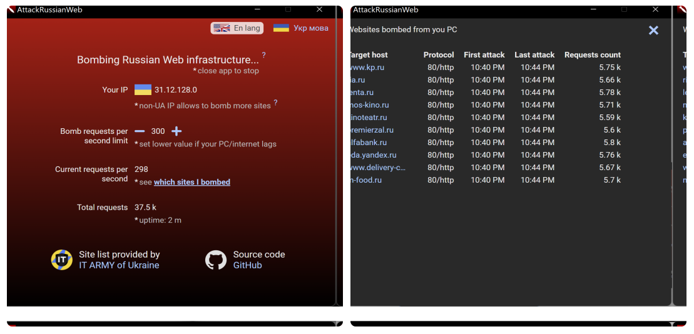

Завантажити застосунок на ваш комп'ютер:

## Windows 10/11

Завантажте, інсталюйте, та запускайте attackrussianweb з Робочого столу


[](https://github.com/redblackfury/AttackRussianWeb/releases/download/v3.0/AttackRussianWeb_0.3.0.msi)
<!-- [](https://github.com) -->

## Windows 7/8

Для "древніх" Windows доведеться попотіти пару хвилин:
1. Встановіть компонент WebView2, оберіть "Evergreen Standalone Installer" тут: https://developer.microsoft.com/en-us/microsoft-edge/webview2/#download-section
2. Встановіть оновлення KB3080149 звідси https://www.microsoft.com/en-us/download/details.aspx?id=48638 
2. Встановіть VC Redist. Якщо у вас 32-біт то цю: https://aka.ms/vs/17/release/vc_redist.x86.exe А якщо 64-біт то цю: https://aka.ms/vs/17/release/vc_redist.x64.exe

Тупер просто завантажте, інсталюйте, та запускайте AttackRussianWeb з Робочого столу:

[](https://github.com/redblackfury/AttackRussianWeb/releases/download/v3.0/AttackRussianWeb_0.3.0.msi)

# Скріншот


[](./app/assets/screen.svg)


# How this botnet works

Each client oftenly performs requests to centrilized DDoS-protected Server which returns list of sites to attak (Targets). Our Administrators which are located in safe places of our planet (Far away from the war) oftenly refresh list of aggresors sites and using requests from IT ARMY of Ukraine Telegram Channel https://t.me/itarmyofukraine2022
You are always able to see sites and servers which were bombed from your device and don't hurt another websites.

By reviewing a codebase on GitHub you can verify the list of bombed websites in application is complete and does not hide any extra actions apart of DDoS attack. You can make sure it is not malware / virus / miner and confirm that app even does not leave any track on computer. Once you close it, it stops attak, once you start it starts attack.

Inspired and powered by Ukrainian Internet Army:

[](https://www.facebook.com/ukrainian.internet.army/)


# For Russians: how to stop an attack?

For Russian websites who are under attack.

The only way to stop attack is to satisfy all next conditions:

1. Russia must withdraw all troops from Ukraine.
2. Russia must recover all facilities destroyed by their bombs and shelling, including buildings, machinery, roads and squares. If something could not be recovered it should be compensated with price agreed with Ukrainian government. All companies which did a business in Ukraine during war, and which has damaged warehouses, stores and offices must receive compensation and payments for downtime.
3. For each civil killed by Russian army and bombs in Ukraine in war 2022, Russia must publicly pay $1 million USA dollars to Ukrainian government. For each child killed by Russians, Russia must pay $10 millions USA dollars to Ukrainian government.
4. Ukrainian government must reinvest paid money into population recovery

You think it is impossible to implement? Well, it is not our problem. Ukraine never invaded into independent countries and never killed civil peoples there, so we don't know how to help you with it, just do it by any means.

Until all 4 points will be satisfied or until the complete collapse of the Russian Federation, we will not stop Attack.


# Build app by yourself (For developers)

1) Install cargo. Get installer for Windows: https://tauri.studio/docs/getting-started/setting-up-windows/#3-rustc-and-cargo-package-manager

2) Install Node JS (Version 14 or later). for Windows:

Enable yarn (in CMD.exe executed from Administrator):

```
corepack enable
```

On Linux:

```
sudo corepack enable
```


3) Install packages:

```
cd app
yarn
```

## Run app in development mode (with DevTools)

```
yarn tauri:serve
```

In Windows, you might also need set execution policy (In PowerShell from Administrator)

```
Set-ExecutionPolicy RemoteSigned
```

## Build binary for your OS

Works on Windows / Linux / Mac

```
yarn tauri:build
```


